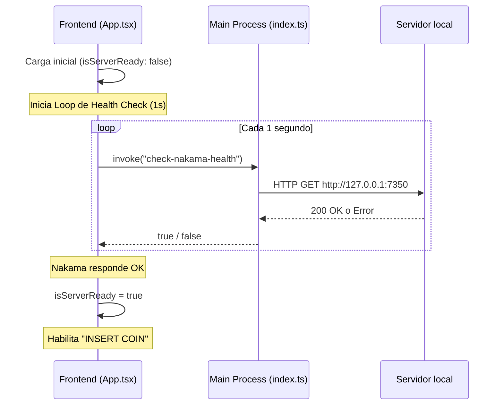

# Diseño del Sistema - Fase 1.3

## 1. Flujo de Control de Salud de Nakama (Spinner)



## 2. Inyección de Configuración Anti-Lag

Al disparar `launch-game`:
1. El Main Process de Electron verifica si existe el archivo `retroarch/netplay_optimized.cfg`.
2. Si existe, concatena los argumentos `["--appendconfig", path_to_cfg]` al lanzar el proceso hijo de RetroArch.

### Estructura de `netplay_optimized.cfg`
```ini
run_ahead_enabled = "true"
run_ahead_frames = "1"
run_ahead_secondary_instance = "false"
netplay_input_latency_frames_min = "1"
netplay_input_latency_frames_range = "0"
netplay_check_frames = "0"
video_frame_delay = "8"
video_hard_sync = "true"
video_hard_sync_frames = "0"
```