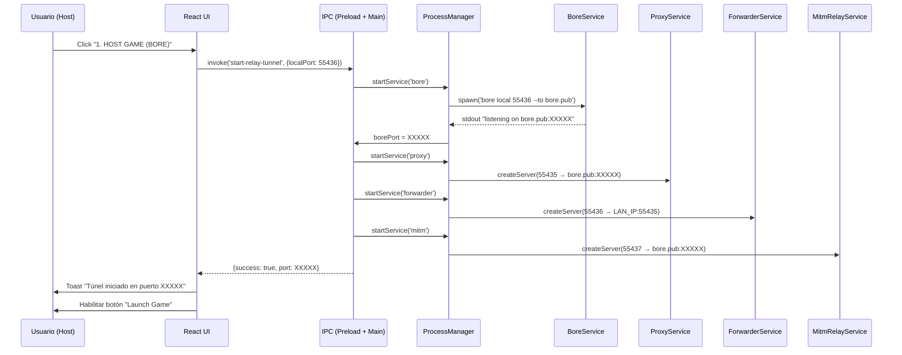
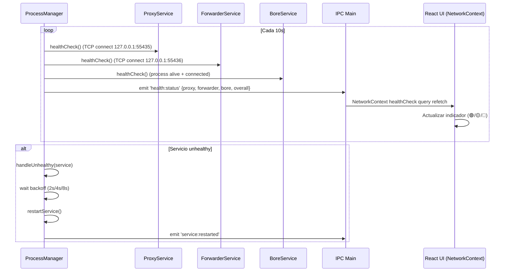
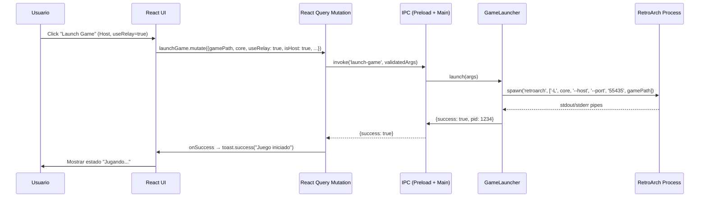

# 03-Diseno.md — Diseño Arquitectónico Plan de Mejoras Nemotron 3 Ultra

## 1. Visión General de la Arquitectura Objetivo

### 1.1 Arquitectura Actual (Problemas)
```
┌─────────────────────────────────────────────────────────────────┐
│                        RENDERER (React)                         │
│  ┌─────────────┐  ┌─────────────┐  ┌─────────────┐              │
│  │  Componente │  │  Componente │  │  Componente │  ...         │
│  │   Host      │  │   Join      │  │  Settings   │              │
│  └──────┬──────┘  └──────┬──────┘  └──────┬──────┘              │
│         │                │                │                      │
│         ▼                ▼                ▼                      │
│  ┌─────────────────────────────────────────────────────────┐    │
│  │              IPC DIRECTO (sin validación)               │    │
│  │  invoke('launch-game', args) → main process             │    │
│  └────────────────────────────┬────────────────────────────┘    │
└───────────────────────────────│─────────────────────────────────┘
                                │
                                ▼
┌─────────────────────────────────────────────────────────────────┐
│                      MAIN PROCESS (Electron)                    │
│  ┌─────────────┐  ┌─────────────┐  ┌─────────────┐              │
│  │  launch-    │  │  start-     │  │  Servicios  │              │
│  │  game.ts    │  │  relay-     │  │  sueltos    │              │
│  │  (monolito) │  │  tunnel.ts  │  │  (proxy,    │              │
│  └─────────────┘  └─────────────┘  │  forwarder, │              │
│                                    │  mitm)      │              │
│                                    └─────────────┘              │
└─────────────────────────────────────────────────────────────────┘
```

**Problemas identificados:**
- Tipos IPC duplicados en 3 ubicaciones (`main`, `preload`, `renderer`)
- Sin validación runtime de payloads IPC
- Servicios de red acoplados en handlers IPC monolíticos
- Sin health checks, sin lifecycle management, sin métricas
- Logging disperso con `console.log`

---

### 1.2 Arquitectura Objetivo (Post-Mejora 1-3)

```
┌─────────────────────────────────────────────────────────────────┐
│                        RENDERER (React)                         │
│  ┌─────────────────────────────────────────────────────────┐    │
│  │              NetworkContext (Provider)                   │    │
│  │  ┌─────────────┐  ┌─────────────┐  ┌─────────────┐       │    │
│  │  │ useHealth   │  │ useMatch-   │  │ useRelay    │       │    │
│  │  │ Check()     │  │ making()    │  │ Tunnel()    │       │    │
│  │  └──────┬──────┘  └──────┬──────┘  └──────┬──────┘       │    │
│  └─────────│────────────────│────────────────│──────────────┘    │
│            ▼                ▼                ▼                    │
│  ┌─────────────────────────────────────────────────────────┐    │
│  │              React Query (TanStack Query v5)             │    │
│  │  QueryClient: retry=3, staleTime=30s, cacheTime=5m      │    │
│  │  Devtools: desarrollo                                    │    │
│  └────────────────────────────┬────────────────────────────┘    │
│                               │                                 │
│                               ▼                                 │
│  ┌─────────────────────────────────────────────────────────┐    │
│  │              IPC Typed Wrappers (api.ts)                 │    │
│  │  launchGame(args) → typed invoke                         │    │
│  │  startRelayTunnel(args) → typed invoke                   │    │
│  │  healthCheck() → typed invoke                            │    │
│  └────────────────────────────┬────────────────────────────┘    │
└───────────────────────────────│─────────────────────────────────┘
                                │
                                ▼  IPC con validación Zod (preload)
┌─────────────────────────────────────────────────────────────────┐
│                      MAIN PROCESS (Electron)                    │
│  ┌─────────────────────────────────────────────────────────┐    │
│  │              ProcessManager (Systemd-style)              │    │
│  │  ┌─────────────┐ ┌─────────────┐ ┌─────────────┐        │    │
│  │  │ ProxyService│ │ Forwarder   │ │ MitmRelay   │        │    │
│  │  │ (TCP Proxy) │ │ Service     │ │ Service     │        │    │
│  │  └──────┬──────┘ └──────┬──────┘ └──────┬──────┘        │    │
│  │         │               │               │                │    │
│  │         └───────────────┼───────────────┘                │    │
│  │                         ▼                                │    │
│  │              HealthChecker (TCP + payload)               │    │
│  │              CircuitBreaker (threshold: 5, reset: 60s)   │    │
│  │              AutoRestart (backoff: 2s/4s/8s, max: 3)     │    │
│  └────────────────────────────┬────────────────────────────┘    │
│                               │                                 │
│  ┌────────────────────────────┴────────────────────────────┐    │
│  │              IPC Handlers (tipados con Zod)              │    │
│  │  start-relay-tunnel → ProcessManager.startRelay()        │    │
│  │  stop-relay-tunnel  → ProcessManager.stopRelay()         │    │
│  │  health-check         → ProcessManager.healthCheck()     │    │
│  │  get-metrics          → ProcessManager.getMetrics()      │    │
│  │  launch-game          → GameLauncher.launch()            │    │
│  └──────────────────────────────────────────────────────────┘    │
│                               │                                 │
│                               ▼                                 │
│  ┌─────────────────────────────────────────────────────────┐    │
│  │              Winston Logger (Structured)                 │    │
│  │  Transports: Console (pretty) + File (JSON, rotated)    │    │
│  │  Rotation: 10MB, maxFiles: 30, compress: true           │    │
│  │  Context: { service, correlationId, pid }               │    │
│  └─────────────────────────────────────────────────────────┘    │
└─────────────────────────────────────────────────────────────────┘
```

---

## 2. Diseño por Mejora (Alta Prioridad)

### 2.1 Mejora 1: Paquete Shared IPC Types (`@emu-latam/ipc-types`)

#### 2.1.1 Estructura del Paquete
```
packages/ipc-types/
├── package.json
├── tsconfig.json
├── src/
│   ├── index.ts              # Exports públicos
│   ├── channels.ts           # Definición de canales IPC
│   ├── payloads.ts           # Tipos de payloads (args, returns)
│   ├── validators.ts         # Esquemas Zod + helpers parse()
│   └── errors.ts             # ErrorPayload tipado
├── dist/                     # Generado por build
└── tests/
    └── validators.test.ts
```

#### 2.1.2 Canales IPC Definidos (`channels.ts`)
```typescript
// Canales Main → Renderer (eventos)
export const MainToRendererChannels = {
  HEALTH_STATUS: 'health:status',
  RELAY_STATUS: 'relay:status',
  MATCHMAKING_UPDATE: 'matchmaking:update',
  LOG_ENTRY: 'log:entry',
  ERROR_OCCURRED: 'error:occurred',
} as const;

// Canales Renderer → Main (invokes)
export const RendererToMainChannels = {
  LAUNCH_GAME: 'launch-game',
  START_RELAY_TUNNEL: 'start-relay-tunnel',
  STOP_RELAY_TUNNEL: 'stop-relay-tunnel',
  HEALTH_CHECK: 'health-check',
  GET_METRICS: 'get-metrics',
  GET_LOGS: 'get-logs',
  GET_CONFIG: 'get-config',
  SET_CONFIG: 'set-config',
} as const;

export type IpcChannel = 
  | typeof MainToRendererChannels[keyof typeof MainToRendererChannels]
  | typeof RendererToMainChannels[keyof typeof RendererToMainChannels];
```

#### 2.1.3 Payloads Tipados (`payloads.ts`)
```typescript
// Args para launch-game
export interface LaunchGameArgs {
  gamePath: string;
  core: string;
  useRelay: boolean;
  relayIp?: string;
  relayPort?: number;
  isHost: boolean;
  playerName: string;
  netplayPort?: number; // default 55435
}

// Args para start-relay-tunnel
export interface StartRelayTunnelArgs {
  localPort: number;        // 55436 (forwarder)
  targetHost: string;       // LAN IP del host
  targetPort: number;       // 55435 (RetroArch)
  borePort?: number;        // Puerto asignado por bore.pub (runtime)
}

// Resultado health-check
export interface HealthCheckResult {
  proxy: ServiceHealth;
  forwarder: ServiceHealth;
  bore: ServiceHealth;
  retroarch: ServiceHealth;
  timestamp: number;
  overall: 'healthy' | 'degraded' | 'unhealthy';
}

export interface ServiceHealth {
  status: 'healthy' | 'unhealthy' | 'unknown';
  latencyMs?: number;
  lastCheck: number;
  error?: string;
}

// Métricas del sistema
export interface SystemMetrics {
  proxy: ProxyMetrics;
  forwarder: ForwarderMetrics;
  mitm: MitmMetrics;
  bore: BoreMetrics;
  uptimeMs: number;
}

export interface ProxyMetrics {
  connectionsTotal: number;
  connectionsActive: number;
  bytesProxied: number;
  errors: number;
}

// ... más métricas por servicio
```

#### 2.1.4 Validadores Zod (`validators.ts`)
```typescript
import { z } from 'zod';
import type { LaunchGameArgs, StartRelayTunnelArgs, HealthCheckResult } from './payloads';

export const LaunchGameArgsSchema = z.object({
  gamePath: z.string().min(1),
  core: z.string().min(1),
  useRelay: z.boolean(),
  relayIp: z.string().ip().optional(),
  relayPort: z.number().int().positive().optional(),
  isHost: z.boolean(),
  playerName: z.string().min(1).max(32),
  netplayPort: z.number().int().positive().default(55435),
});

export const StartRelayTunnelArgsSchema = z.object({
  localPort: z.number().int().positive().default(55436),
  targetHost: z.string().min(1), // IP LAN, no validamos IP estricta por flexibilidad
  targetPort: z.number().int().positive().default(55435),
  borePort: z.number().int().positive().optional(),
});

export const HealthCheckResultSchema = z.object({
  proxy: z.object({ status: z.enum(['healthy', 'unhealthy', 'unknown']), latencyMs: z.number().optional(), lastCheck: z.number(), error: z.string().optional() }),
  forwarder: z.object({ status: z.enum(['healthy', 'unhealthy', 'unknown']), latencyMs: z.number().optional(), lastCheck: z.number(), error: z.string().optional() }),
  bore: z.object({ status: z.enum(['healthy', 'unhealthy', 'unknown']), latencyMs: z.number().optional(), lastCheck: z.number(), error: z.string().optional() }),
  retroarch: z.object({ status: z.enum(['healthy', 'unhealthy', 'unknown']), latencyMs: z.number().optional(), lastCheck: z.number(), error: z.string().optional() }),
  timestamp: z.number(),
  overall: z.enum(['healthy', 'degraded', 'unhealthy']),
});

// Helper para validación en preload
export function validateIpcPayload<T>(schema: z.ZodSchema<T>, payload: unknown): T {
  const result = schema.safeParse(payload);
  if (!result.success) {
    throw new Error(`IPC validation failed: ${result.error.message}`);
  }
  return result.data;
}
```

#### 2.1.5 ErrorPayload Tipado (`errors.ts`)
```typescript
export interface ErrorPayload {
  code: string;           // Código máquina: 'LAUNCH_FAILED', 'TUNNEL_TIMEOUT', 'HEALTH_CHECK_FAILED'
  message: string;        // Mensaje humano legible
  context?: Record<string, unknown>; // Contexto adicional para debugging
  recoverable: boolean;   // Si el usuario puede reintentar (retry button en toast)
  timestamp: number;      // Date.now()
  correlationId?: string; // Para tracing en logs
}

export const ErrorPayloadSchema = z.object({
  code: z.string(),
  message: z.string(),
  context: z.record(z.unknown()).optional(),
  recoverable: z.boolean(),
  timestamp: z.number(),
  correlationId: z.string().optional(),
});
```

#### 2.1.6 Integración en Preload (Runtime Validation)
```typescript
// client/src/preload/index.ts
import { contextBridge, ipcRenderer } from 'electron';
import { validateIpcPayload, LaunchGameArgsSchema, StartRelayTunnelArgsSchema } from '@emu-latam/ipc-types';

contextBridge.exposeInMainWorld('ipc', {
  launchGame: (args: unknown) => {
    const validated = validateIpcPayload(LaunchGameArgsSchema, args);
    return ipcRenderer.invoke('launch-game', validated);
  },
  startRelayTunnel: (args: unknown) => {
    const validated = validateIpcPayload(StartRelayTunnelArgsSchema, args);
    return ipcRenderer.invoke('start-relay-tunnel', validated);
  },
  // ... resto de canales
  onHealthStatus: (callback: (status: HealthCheckResult) => void) => {
    ipcRenderer.on('health:status', (_e, payload) => callback(payload));
  },
});
```

---

### 2.2 Mejora 2: NetworkContext + React Query (TanStack Query v5)

#### 2.2.1 Arquitectura del Contexto
```
NetworkContext Provider
├── QueryClient (global)
│   ├── queryKey: ['health'] → refetchInterval: 10000
│   ├── queryKey: ['relay-status'] → refetchInterval: 5000
│   ├── queryKey: ['matchmaking', matchId] → enabled: !!matchId
│   └── mutationKey: ['launch-game'] → onError: toast.error
│
├── Hooks Exportados
│   ├── useHealthCheck() → { data, isLoading, error, refetch }
│   ├── useRelayStatus() → { data, isLoading, error }
│   ├── useMatchmaking(matchId?) → { data, mutate, isPending }
│   ├── useLaunchGame() → mutation { mutate, isPending, isError }
│   └── useRelayTunnel() → mutation { mutate, isPending }
│
└── Tipos derivados de @emu-latam/ipc-types
```

#### 2.2.2 Implementación (`client/src/renderer/src/context/NetworkContext.tsx`)
```typescript
import { createContext, useContext, useMemo, ReactNode } from 'react';
import { QueryClient, QueryClientProvider, useQuery, useMutation } from '@tanstack/react-query';
import { toast } from 'react-hot-toast';
import type { HealthCheckResult, LaunchGameArgs, StartRelayTunnelArgs, SystemMetrics } from '@emu-latam/ipc-types';
import { ipc } from '@/lib/ipc'; // Wrapper tipado sobre window.ipc

// QueryClient singleton
const queryClient = new QueryClient({
  defaultOptions: {
    queries: {
      retry: 3,
      retryDelay: (attemptIndex) => Math.min(1000 * 2 ** attemptIndex, 30000),
      staleTime: 30_000,
      gcTime: 5 * 60 * 1000,
      refetchOnWindowFocus: false,
    },
    mutations: {
      onError: (error: Error) => {
        toast.error(error.message, { id: 'mutation-error' });
      },
    },
  },
});

interface NetworkContextValue {
  // Queries
  healthCheck: ReturnType<typeof useQuery<HealthCheckResult>>;
  relayStatus: ReturnType<typeof useQuery<{ connected: boolean; port?: number }>>;
  metrics: ReturnType<typeof useQuery<SystemMetrics>>;
  // Mutations
  launchGame: ReturnType<typeof useMutation>;
  startRelayTunnel: ReturnType<typeof useMutation>;
  stopRelayTunnel: ReturnType<typeof useMutation>;
  // Helpers
  invalidateHealth: () => void;
}

const NetworkContext = createContext<NetworkContextValue | null>(null);

export function NetworkProvider({ children }: { children: ReactNode }) {
  const healthCheck = useQuery({
    queryKey: ['health'],
    queryFn: () => ipc.healthCheck(),
    refetchInterval: 10_000,
    refetchOnWindowFocus: true,
  });

  const relayStatus = useQuery({
    queryKey: ['relay-status'],
    queryFn: () => ipc.getRelayStatus(),
    refetchInterval: 5_000,
    enabled: false, // Se habilita cuando hay túnel activo
  });

  const metrics = useQuery({
    queryKey: ['metrics'],
    queryFn: () => ipc.getMetrics(),
    refetchInterval: 15_000,
  });

  const launchGame = useMutation({
    mutationFn: (args: LaunchGameArgs) => ipc.launchGame(args),
    onSuccess: () => toast.success('Juego iniciado correctamente'),
  });

  const startRelayTunnel = useMutation({
    mutationFn: (args: StartRelayTunnelArgs) => ipc.startRelayTunnel(args),
    onSuccess: () => {
      toast.success('Túnel de relay iniciado');
      queryClient.invalidateQueries({ queryKey: ['relay-status'] });
    },
  });

  const stopRelayTunnel = useMutation({
    mutationFn: () => ipc.stopRelayTunnel(),
    onSuccess: () => toast.success('Túnel de relay detenido'),
  });

  const value = useMemo(() => ({
    healthCheck,
    relayStatus,
    metrics,
    launchGame,
    startRelayTunnel,
    stopRelayTunnel,
    invalidateHealth: () => queryClient.invalidateQueries({ queryKey: ['health'] }),
  }), [healthCheck, relayStatus, metrics, launchGame, startRelayTunnel, stopRelayTunnel]);

  return (
    <QueryClientProvider client={queryClient}>
      <NetworkContext.Provider value={value}>
        {children}
      </NetworkContext.Provider>
    </QueryClientProvider>
  );
}

export function useNetwork() {
  const context = useContext(NetworkContext);
  if (!context) throw new Error('useNetwork debe usarse dentro de NetworkProvider');
  return context;
}
```

#### 2.2.3 Wrapper IPC Tipado (`client/src/renderer/src/lib/ipc.ts`)
```typescript
import type { 
  LaunchGameArgs, 
  StartRelayTunnelArgs, 
  HealthCheckResult, 
  SystemMetrics,
  ErrorPayload 
} from '@emu-latam/ipc-types';

declare global {
  interface Window {
    ipc: {
      launchGame: (args: LaunchGameArgs) => Promise<{ success: boolean; error?: ErrorPayload }>;
      startRelayTunnel: (args: StartRelayTunnelArgs) => Promise<{ success: boolean; error?: ErrorPayload; port?: number }>;
      stopRelayTunnel: () => Promise<{ success: boolean; error?: ErrorPayload }>;
      healthCheck: () => Promise<HealthCheckResult>;
      getMetrics: () => Promise<SystemMetrics>;
      getRelayStatus: () => Promise<{ connected: boolean; port?: number }>;
      onHealthStatus: (callback: (status: HealthCheckResult) => void) => () => void;
      onRelayStatus: (callback: (status: { connected: boolean; port?: number }) => void) => () => void;
      onError: (callback: (error: ErrorPayload) => void) => () => void;
    };
  }
}

export const ipc = window.ipc;
```

---

### 2.3 Mejora 3: Arquitectura Proxy/Forwarder/MITM Robusta

#### 2.3.1 ProcessManager (Systemd-Style Lifecycle)
```typescript
// client/src/main/services/ProcessManager.ts
import { EventEmitter } from 'events';
import { spawn, ChildProcess, SpawnOptions } from 'child_process';
import { logger } from '../logger';

export interface ServiceConfig {
  name: string;
  command: string;
  args: string[];
  cwd?: string;
  env?: Record<string, string>;
  healthCheck?: HealthCheckConfig;
  restartPolicy?: RestartPolicy;
}

export interface HealthCheckConfig {
  intervalMs: number;      // Default: 10000
  timeoutMs: number;       // Default: 3000
  retries: number;         // Default: 3
  check: () => Promise<boolean>; // Custom health check function
}

export interface RestartPolicy {
  maxRetries: number;      // Default: 3
  backoffMs: number[];     // Default: [2000, 4000, 8000]
  resetAfterMs: number;    // Default: 60000 (circuit breaker reset)
}

export interface ServiceStatus {
  name: string;
  pid: number | null;
  status: 'stopped' | 'starting' | 'running' | 'unhealthy' | 'stopping';
  restartCount: number;
  lastHealthCheck: number | null;
  uptimeMs: number;
}

export class ProcessManager extends EventEmitter {
  private services = new Map<string, ManagedService>();
  private healthCheckIntervals = new Map<string, NodeJS.Timeout>();

  async startService(config: ServiceConfig): Promise<void> {
    if (this.services.has(config.name)) {
      throw new Error(`Service ${config.name} already exists`);
    }

    const service = new ManagedService(config, this.logger);
    this.services.set(config.name, service);
    
    await service.start();
    this.setupHealthCheck(service);
    
    this.emit('service:started', service.getStatus());
  }

  async stopService(name: string): Promise<void> {
    const service = this.services.get(name);
    if (!service) return;
    
    await service.stop();
    this.clearHealthCheck(name);
    this.services.delete(name);
    this.emit('service:stopped', name);
  }

  async restartService(name: string): Promise<void> {
    const service = this.services.get(name);
    if (!service) throw new Error(`Service ${name} not found`);
    await service.restart();
  }

  getStatus(name: string): ServiceStatus | null {
    return this.services.get(name)?.getStatus() ?? null;
  }

  getAllStatus(): ServiceStatus[] {
    return Array.from(this.services.values()).map(s => s.getStatus());
  }

  private setupHealthCheck(service: ManagedService): void {
    const config = service.config.healthCheck;
    if (!config) return;

    const interval = setInterval(async () => {
      const healthy = await service.runHealthCheck();
      if (!healthy) {
        this.handleUnhealthy(service);
      }
    }, config.intervalMs);

    this.healthCheckIntervals.set(service.config.name, interval);
  }

  private async handleUnhealthy(service: ManagedService): Promise<void> {
    const policy = service.config.restartPolicy ?? { maxRetries: 3, backoffMs: [2000, 4000, 8000], resetAfterMs: 60000 };
    
    if (service.restartCount < policy.maxRetries) {
      const delay = policy.backoffMs[Math.min(service.restartCount, policy.backoffMs.length - 1)];
      this.logger.warn({ service: service.config.name, attempt: service.restartCount + 1, delay }, 'Service unhealthy, scheduling restart');
      
      setTimeout(() => service.restart(), delay);
    } else {
      this.logger.error({ service: service.config.name }, 'Max retries reached, circuit breaker open');
      this.emit('service:circuit-open', service.config.name);
    }
  }

  private clearHealthCheck(name: string): void {
    const interval = this.healthCheckIntervals.get(name);
    if (interval) clearInterval(interval);
    this.healthCheckIntervals.delete(name);
  }
}

class ManagedService {
  public restartCount = 0;
  public lastRestartTime = 0;
  public process: ChildProcess | null = null;
  public startTime = 0;
  public status: ServiceStatus['status'] = 'stopped';

  constructor(
    public readonly config: ServiceConfig,
    private readonly logger: Logger
  ) {}

  async start(): Promise<void> {
    this.status = 'starting';
    this.startTime = Date.now();
    
    this.process = spawn(this.config.command, this.config.args, {
      cwd: this.config.cwd,
      env: { ...process.env, ...this.config.env },
      stdio: ['ignore', 'pipe', 'pipe'],
      windowsHide: true,
    });

    this.process.stdout?.on('data', (data) => this.logger.debug({ service: this.config.name, stdout: data.toString() }));
    this.process.stderr?.on('data', (data) => this.logger.warn({ service: this.config.name, stderr: data.toString() }));

    this.process.on('exit', (code, signal) => {
      this.logger.info({ service: this.config.name, code, signal }, 'Process exited');
      this.status = 'stopped';
      this.process = null;
    });

    // Wait for process to be ready (custom ready check per service)
    await this.waitForReady();
    this.status = 'running';
  }

  async stop(): Promise<void> {
    this.status = 'stopping';
    if (this.process) {
      this.process.kill('SIGTERM');
      await this.waitForExit(5000);
      if (this.process) {
        this.process.kill('SIGKILL');
        await this.waitForExit(1000);
      }
    }
    this.status = 'stopped';
  }

  async restart(): Promise<void> {
    await this.stop();
    this.restartCount++;
    this.lastRestartTime = Date.now();
    await this.start();
  }

  async runHealthCheck(): Promise<boolean> {
    if (!this.config.healthCheck) return true;
    try {
      return await this.config.healthCheck.check();
    } catch (e) {
      return false;
    }
  }

  getStatus(): ServiceStatus {
    return {
      name: this.config.name,
      pid: this.process?.pid ?? null,
      status: this.status,
      restartCount: this.restartCount,
      lastHealthCheck: Date.now(),
      uptimeMs: this.startTime ? Date.now() - this.startTime : 0,
    };
  }

  private async waitForReady(): Promise<void> {
    // Implementado por cada servicio concreto
    await new Promise(r => setTimeout(r, 500)); // Default
  }

  private async waitForExit(timeoutMs: number): Promise<void> {
    return new Promise(resolve => {
      const timeout = setTimeout(resolve, timeoutMs);
      this.process?.once('exit', () => { clearTimeout(timeout); resolve(); });
    });
  }
}
```

#### 2.3.2 ProxyService (TCP Proxy 127.0.0.1:55435 → bore.pub:XXXXX)
```typescript
// client/src/main/services/ProxyService.ts
import { createServer, Server, Socket } from 'net';
import { EventEmitter } from 'events';
import { logger } from '../logger';

export interface ProxyConfig {
  listenPort: number;        // 55435 (puerto que RetroArch guest conecta)
  targetHost: string;        // bore.pub
  targetPort: number;        // Puerto dinámico asignado por bore
  maxConnections: number;    // Default: 10
}

export interface ProxyMetrics {
  connectionsTotal: number;
  connectionsActive: number;
  bytesProxied: number;
  errors: number;
}

export class ProxyService extends EventEmitter {
  private server: Server | null = null;
  private connections = new Map<number, { client: Socket; target: Socket }>();
  private connectionId = 0;
  public metrics: ProxyMetrics = { connectionsTotal: 0, connectionsActive: 0, bytesProxied: 0, errors: 0 };

  constructor(private config: ProxyConfig) {
    super();
  }

  async start(): Promise<void> {
    return new Promise((resolve, reject) => {
      this.server = createServer({ pauseOnConnect: true }, (client) => this.handleConnection(client));
      
      this.server.on('error', (err) => {
        this.metrics.errors++;
        logger.error({ service: 'proxy', error: err.message }, 'Proxy server error');
        reject(err);
      });

      this.server.listen(this.config.listenPort, '127.0.0.1', () => {
        logger.info({ service: 'proxy', port: this.config.listenPort }, 'Proxy server started');
        resolve();
      });
    });
  }

  async stop(): Promise<void> {
    // Close all active connections
    for (const [, { client, target }] of this.connections) {
      client.destroy();
      target.destroy();
    }
    this.connections.clear();

    return new Promise((resolve) => {
      this.server?.close(() => {
        this.server = null;
        logger.info({ service: 'proxy' }, 'Proxy server stopped');
        resolve();
      });
    });
  }

  private handleConnection(client: Socket): void {
    if (this.connectionsActive >= this.config.maxConnections) {
      client.destroy();
      return;
    }

    const id = ++this.connectionId;
    this.metrics.connectionsTotal++;
    this.metrics.connectionsActive++;

    const target = createConnection({ host: this.config.targetHost, port: this.config.targetPort }, () => {
      // Pipe bidireccional con backpressure handling
      client.pipe(target, { end: false });
      target.pipe(client, { end: false });

      client.on('data', (chunk) => { this.metrics.bytesProxied += chunk.length; });
      target.on('data', (chunk) => { this.metrics.bytesProxied += chunk.length; });

      const cleanup = () => {
        this.connections.delete(id);
        this.metrics.connectionsActive--;
        client.destroy();
        target.destroy();
      };

      client.on('close', cleanup);
      target.on('close', cleanup);
      client.on('error', (e) => { this.metrics.errors++; cleanup(); });
      target.on('error', (e) => { this.metrics.errors++; cleanup(); });
    });

    target.on('error', (err) => {
      this.metrics.errors++;
      logger.warn({ service: 'proxy', connectionId: id, error: err.message }, 'Target connection error');
      client.destroy();
    });

    this.connections.set(id, { client, target });
  }

  async healthCheck(): Promise<boolean> {
    if (!this.server?.listening) return false;
    // Quick TCP connect test
    return new Promise(resolve => {
      const testSocket = createConnection({ port: this.config.listenPort, host: '127.0.0.1' }, () => {
        testSocket.destroy();
        resolve(true);
      });
      testSocket.on('error', () => resolve(false));
      testSocket.setTimeout(2000, () => { testSocket.destroy(); resolve(false); });
    });
  }

  getMetrics(): ProxyMetrics {
    return { ...this.metrics };
  }
}
```

#### 2.3.3 ForwarderService (TCP Forwarder 127.0.0.1:55436 → LAN_IP:55435)
```typescript
// client/src/main/services/ForwarderService.ts
import { createServer, Server, Socket, createConnection } from 'net';
import { EventEmitter } from 'events';
import { logger } from '../logger';
import { getLanIp } from '../utils/network';

export interface ForwarderConfig {
  listenPort: number;        // 55436 (puerto local del forwarder)
  targetPort: number;        // 55435 (puerto RetroArch host)
  maxConnections: number;    // Default: 10
}

export interface ForwarderMetrics {
  connectionsTotal: number;
  connectionsActive: number;
  bytesForwarded: number;
  errors: number;
}

export class ForwarderService extends EventEmitter {
  private server: Server | null = null;
  private connections = new Map<number, { client: Socket; target: Socket }>();
  private connectionId = 0;
  public metrics: ForwarderMetrics = { connectionsTotal: 0, connectionsActive: 0, bytesForwarded: 0, errors: 0 };
  private targetHost: string = '';

  constructor(private config: ForwarderConfig) {
    super();
  }

  async start(): Promise<void> {
    // Resolver LAN IP al inicio (evita 127.0.0.1 conflict con proxy)
    this.targetHost = await getLanIp();
    if (!this.targetHost) {
      throw new Error('No se pudo determinar IP LAN para forwarder');
    }

    return new Promise((resolve, reject) => {
      this.server = createServer({ pauseOnConnect: true }, (client) => this.handleConnection(client));
      
      this.server.on('error', (err) => {
        this.metrics.errors++;
        logger.error({ service: 'forwarder', error: err.message }, 'Forwarder server error');
        reject(err);
      });

      this.server.listen(this.config.listenPort, '127.0.0.1', () => {
        logger.info({ service: 'forwarder', port: this.config.listenPort, target: `${this.targetHost}:${this.config.targetPort}` }, 'Forwarder started');
        resolve();
      });
    });
  }

  async stop(): Promise<void> {
    for (const [, { client, target }] of this.connections) {
      client.destroy();
      target.destroy();
    }
    this.connections.clear();

    return new Promise(resolve => {
      this.server?.close(() => {
        this.server = null;
        logger.info({ service: 'forwarder' }, 'Forwarder stopped');
        resolve();
      });
    });
  }

  private handleConnection(client: Socket): void {
    if (this.metrics.connectionsActive >= this.config.maxConnections) {
      client.destroy();
      return;
    }

    const id = ++this.connectionId;
    this.metrics.connectionsTotal++;
    this.metrics.connectionsActive++;

    // Conectar a LAN_IP:55435 (NO 127.0.0.1 para evitar conflicto con proxy)
    const target = createConnection({ host: this.targetHost, port: this.config.targetPort }, () => {
      client.pipe(target, { end: false });
      target.pipe(client, { end: false });

      client.on('data', (chunk) => { this.metrics.bytesForwarded += chunk.length; });
      target.on('data', (chunk) => { this.metrics.bytesForwarded += chunk.length; });

      const cleanup = () => {
        this.connections.delete(id);
        this.metrics.connectionsActive--;
        client.destroy();
        target.destroy();
      };

      client.on('close', cleanup);
      target.on('close', cleanup);
      client.on('error', (e) => { this.metrics.errors++; cleanup(); });
      target.on('error', (e) => { this.metrics.errors++; cleanup(); });
    });

    target.on('error', (err) => {
      this.metrics.errors++;
      logger.warn({ service: 'forwarder', connectionId: id, error: err.message }, 'Target connection failed');
      client.destroy();
    });

    this.connections.set(id, { client, target });
  }

  async healthCheck(): Promise<boolean> {
    if (!this.server?.listening) return false;
    return new Promise(resolve => {
      const testSocket = createConnection({ port: this.config.listenPort, host: '127.0.0.1' }, () => {
        testSocket.destroy();
        resolve(true);
      });
      testSocket.on('error', () => resolve(false));
      testSocket.setTimeout(2000, () => { testSocket.destroy(); resolve(false); });
    });
  }

  getMetrics(): ForwarderMetrics {
    return { ...this.metrics };
  }
}
```

#### 2.3.4 MitmRelayService (MITM con Framing Length-Prefixed)
```typescript
// client/src/main/services/MitmRelayService.ts
import { createServer, Server, Socket, createConnection } from 'net';
import { EventEmitter } from 'events';
import { logger } from '../logger';

export interface MitmConfig {
  listenPort: number;        // Puerto local para MITM (ej: 55437)
  targetHost: string;        // Host destino (bore.pub o LAN IP)
  targetPort: number;        // Puerto destino
  maxFrameSize: number;      // Default: 1MB
  enableLogging: boolean;    // Log frames para debugging
}

export interface MitmMetrics {
  connectionsTotal: number;
  connectionsActive: number;
  framesIntercepted: number;
  bytesIntercepted: number;
  errors: number;
}

export interface ParsedFrame {
  length: number;
  payload: Buffer;
  timestamp: number;
  direction: 'client->server' | 'server->client';
}

export class MitmRelayService extends EventEmitter {
  private server: Server | null = null;
  private connections = new Map<number, MitmConnection>();
  private connectionId = 0;
  public metrics: MitmMetrics = { connectionsTotal: 0, connectionsActive: 0, framesIntercepted: 0, bytesIntercepted: 0, errors: 0 };

  constructor(private config: MitmConfig) {
    super();
  }

  async start(): Promise<void> {
    return new Promise((resolve, reject) => {
      this.server = createServer({ pauseOnConnect: true }, (client) => this.handleConnection(client));
      
      this.server.on('error', (err) => {
        this.metrics.errors++;
        logger.error({ service: 'mitm', error: err.message }, 'MITM server error');
        reject(err);
      });

      this.server.listen(this.config.listenPort, '127.0.0.1', () => {
        logger.info({ service: 'mitm', port: this.config.listenPort }, 'MITM Relay started');
        resolve();
      });
    });
  }

  async stop(): Promise<void> {
    for (const conn of this.connections.values()) {
      conn.client.destroy();
      conn.target.destroy();
    }
    this.connections.clear();

    return new Promise(resolve => {
      this.server?.close(() => {
        this.server = null;
        logger.info({ service: 'mitm' }, 'MITM Relay stopped');
        resolve();
      });
    });
  }

  private handleConnection(client: Socket): void {
    const id = ++this.connectionId;
    this.metrics.connectionsTotal++;
    this.metrics.connectionsActive++;

    const target = createConnection({ host: this.config.targetHost, port: this.config.targetPort }, () => {
      const conn = new MitmConnection(id, client, target, this.config, this.logger);
      this.connections.set(id, conn);
      
      conn.on('frame', (frame) => {
        this.metrics.framesIntercepted++;
        this.metrics.bytesIntercepted += frame.payload.length;
        this.emit('frame', frame);
      });
      
      conn.on('close', () => {
        this.connections.delete(id);
        this.metrics.connectionsActive--;
      });
      
      conn.on('error', (err) => {
        this.metrics.errors++;
        logger.warn({ service: 'mitm', connectionId: id, error: err.message }, 'MITM connection error');
      });
    });

    target.on('error', (err) => {
      this.metrics.errors++;
      logger.warn({ service: 'mitm', connectionId: id, error: err.message }, 'Target connection failed');
      client.destroy();
    });
  }

  async healthCheck(): Promise<boolean> {
    if (!this.server?.listening) return false;
    return new Promise(resolve => {
      const testSocket = createConnection({ port: this.config.listenPort, host: '127.0.0.1' }, () => {
        testSocket.destroy();
        resolve(true);
      });
      testSocket.on('error', () => resolve(false));
      testSocket.setTimeout(2000, () => { testSocket.destroy(); resolve(false); });
    });
  }

  getMetrics(): MitmMetrics {
    return { ...this.metrics };
  }
}

class MitmConnection extends EventEmitter {
  private clientBuffer = Buffer.alloc(0);
  private targetBuffer = Buffer.alloc(0);
  private readonly HEADER_SIZE = 4; // uint32BE length prefix

  constructor(
    private id: number,
    public readonly client: Socket,
    public readonly target: Socket,
    private config: MitmConfig,
    private logger: Logger
  ) {
    super();
    this.setupPiping();
  }

  private setupPiping(): void {
    // Client -> Target (with framing inspection)
    this.client.on('data', (chunk) => {
      this.clientBuffer = Buffer.concat([this.clientBuffer, chunk]);
      this.processBuffer(this.clientBuffer, 'client->server');
      this.target.write(chunk); // Forward transparently
    });

    // Target -> Client (with framing inspection)
    this.target.on('data', (chunk) => {
      this.targetBuffer = Buffer.concat([this.targetBuffer, chunk]);
      this.processBuffer(this.targetBuffer, 'server->client');
      this.client.write(chunk); // Forward transparently
    });

    const cleanup = () => {
      this.client.destroy();
      this.target.destroy();
      this.emit('close');
    };

    this.client.on('close', cleanup);
    this.target.on('close', cleanup);
    this.client.on('error', (e) => { this.emit('error', e); cleanup(); });
    this.target.on('error', (e) => { this.emit('error', e); cleanup(); });
  }

  private processBuffer(buffer: Buffer, direction: 'client->server' | 'server->client'): void {
    let offset = 0;
    
    while (buffer.length - offset >= this.HEADER_SIZE) {
      const frameLength = buffer.readUInt32BE(offset);
      
      if (frameLength > this.config.maxFrameSize) {
        this.emit('error', new Error(`Frame too large: ${frameLength} > ${this.config.maxFrameSize}`));
        return;
      }

      if (buffer.length - offset < this.HEADER_SIZE + frameLength) {
        break; // Frame incompleto, esperar más datos
      }

      const payload = buffer.subarray(offset + this.HEADER_SIZE, offset + this.HEADER_SIZE + frameLength);
      
      this.emit('frame', {
        length: frameLength,
        payload,
        timestamp: Date.now(),
        direction,
      } as ParsedFrame);

      if (this.config.enableLogging) {
        this.logger.debug({ 
          service: 'mitm', 
          connectionId: this.id, 
          direction, 
          frameLength,
          payloadPreview: payload.subarray(0, 32).toString('hex')
        }, 'Frame intercepted');
      }

      offset += this.HEADER_SIZE + frameLength;
    }

    // Retener datos no procesados
    if (offset > 0) {
      if (direction === 'client->server') {
        this.clientBuffer = buffer.subarray(offset);
      } else {
        this.targetBuffer = buffer.subarray(offset);
      }
    }
  }
}
```

#### 2.3.5 BoreService (Gestión de túnel bore.pub)
```typescript
// client/src/main/services/BoreService.ts
import { spawn, ChildProcess } from 'child_process';
import { EventEmitter } from 'events';
import { logger } from '../logger';

export interface BoreConfig {
  localPort: number;      // Puerto local a tunelizar (55436 forwarder)
  boreHost: string;       // 'bore.pub'
  borePort: number;       // 443 (TLS) o puerto específico
  authToken?: string;     // Opcional para bore.pub
}

export interface BoreMetrics {
  connected: boolean;
  assignedPort: number | null;
  restarts: number;
  uptimeMs: number;
  lastError: string | null;
}

export class BoreService extends EventEmitter {
  private process: ChildProcess | null = null;
  public metrics: BoreMetrics = { connected: false, assignedPort: null, restarts: 0, uptimeMs: 0, lastError: null };
  private startTime = 0;
  private portRegex = /listening on.*:(\d+)/; // Parsear puerto asignado por bore.pub

  constructor(private config: BoreConfig) {
    super();
  }

  async start(): Promise<number> {
    return new Promise((resolve, reject) => {
      const args = ['local', String(this.config.localPort), '--to', this.config.boreHost];
      if (this.config.authToken) args.push('--auth', this.config.authToken);

      this.process = spawn('bore', args, {
        stdio: ['ignore', 'pipe', 'pipe'],
        windowsHide: true,
      });

      this.startTime = Date.now();
      let resolved = false;

      this.process.stdout?.on('data', (data) => {
        const output = data.toString();
        logger.debug({ service: 'bore', output }, 'Bore stdout');
        
        // Extraer puerto asignado: "listening on bore.pub:12345"
        const match = output.match(/listening on.*:(\d+)/);
        if (match && !resolved) {
          const port = parseInt(match[1], 10);
          this.metrics.assignedPort = port;
          this.metrics.connected = true;
          resolved = true;
          logger.info({ service: 'bore', port }, 'Bore tunnel established');
          this.emit('connected', port);
          resolve(port);
        }
      });

      this.process.stderr?.on('data', (data) => {
        const output = data.toString();
        logger.warn({ service: 'bore', output }, 'Bore stderr');
        this.metrics.lastError = output;
      });

      this.process.on('error', (err) => {
        this.metrics.lastError = err.message;
        if (!resolved) {
          resolved = true;
          reject(err);
        }
      });

      this.process.on('exit', (code, signal) => {
        this.metrics.connected = false;
        logger.info({ service: 'bore', code, signal }, 'Bore process exited');
        this.emit('disconnected', { code, signal });
      });

      // Timeout de conexión
      setTimeout(() => {
        if (!resolved) {
          resolved = true;
          this.process?.kill();
          reject(new Error('Bore connection timeout (30s)'));
        }
      }, 30000);
    });
  }

  async stop(): Promise<void> {
    if (this.process) {
      this.process.kill('SIGTERM');
      await new Promise(r => setTimeout(r, 1000));
      if (!this.process.killed) this.process.kill('SIGKILL');
      this.process = null;
    }
    this.metrics.connected = false;
    this.metrics.assignedPort = null;
  }

  async healthCheck(): Promise<boolean> {
    if (!this.metrics.connected || !this.process) return false;
    // Verificar que el proceso sigue vivo
    return !this.process.killed;
  }

  getMetrics(): BoreMetrics {
    return {
      ...this.metrics,
      uptimeMs: this.startTime ? Date.now() - this.startTime : 0,
    };
  }
}
```

#### 2.3.6 Integración en Main Process (IPC Handlers)
```typescript
// client/src/main/ipc/handlers.ts
import { ipcMain } from 'electron';
import { ProcessManager } from '../services/ProcessManager';
import { ProxyService } from '../services/ProxyService';
import { ForwarderService } from '../services/ForwarderService';
import { MitmRelayService } from '../services/MitmRelayService';
import { BoreService } from '../services/BoreService';
import { logger } from '../logger';
import { validateIpcPayload, StartRelayTunnelArgsSchema, LaunchGameArgsSchema } from '@emu-latam/ipc-types';

const processManager = new ProcessManager();
let relayServices: { proxy: ProxyService; forwarder: ForwarderService; mitm: MitmRelayService; bore: BoreService } | null = null;

ipcMain.handle('start-relay-tunnel', async (_event, args: unknown) => {
  const validated = validateIpcPayload(StartRelayTunnelArgsSchema, args);
  const correlationId = crypto.randomUUID();
  logger.info({ correlationId, args: validated }, 'Starting relay tunnel');

  try {
    // 1. Iniciar Bore (obtiene puerto dinámico)
    const bore = new BoreService({
      localPort: validated.localPort,
      boreHost: 'bore.pub',
      borePort: 443,
    });
    const borePort = await bore.start();

    // 2. Iniciar Proxy (127.0.0.1:55435 → bore.pub:borePort)
    const proxy = new ProxyService({
      listenPort: 55435,
      targetHost: 'bore.pub',
      targetPort: borePort,
    });
    await proxy.start();

    // 3. Iniciar Forwarder (127.0.0.1:55436 → LAN_IP:55435)
    const forwarder = new ForwarderService({
      listenPort: validated.localPort, // 55436
      targetPort: 55435,
    });
    await forwarder.start();

    // 4. Iniciar MITM (opcional, para debugging)
    const mitm = new MitmRelayService({
      listenPort: 55437,
      targetHost: 'bore.pub',
      targetPort: borePort,
      enableLogging: true,
    });
    await mitm.start();

    // Registrar en ProcessManager para health checks
    processManager.startService({
      name: 'proxy',
      command: 'node', // Internal, managed by class
      args: [],
      healthCheck: { intervalMs: 10000, timeoutMs: 3000, retries: 3, check: () => proxy.healthCheck() },
    });

    processManager.startService({
      name: 'forwarder',
      command: 'node',
      args: [],
      healthCheck: { intervalMs: 10000, timeoutMs: 3000, retries: 3, check: () => forwarder.healthCheck() },
    });

    processManager.startService({
      name: 'bore',
      command: 'bore',
      args: ['local', String(validated.localPort), '--to', 'bore.pub'],
      healthCheck: { intervalMs: 10000, timeoutMs: 3000, retries: 3, check: () => bore.healthCheck() },
    });

    relayServices = { proxy, forwarder, mitm, bore };

    // Emitir evento a renderer
    mainWindow?.webContents.send('relay:status', { connected: true, port: borePort });

    return { success: true, port: borePort };
  } catch (error) {
    logger.error({ correlationId, error: error.message }, 'Failed to start relay tunnel');
    await cleanupRelayServices();
    return { success: false, error: { code: 'TUNNEL_START_FAILED', message: error.message, recoverable: true, timestamp: Date.now(), correlationId } };
  }
});

ipcMain.handle('stop-relay-tunnel', async () => {
  await cleanupRelayServices();
  mainWindow?.webContents.send('relay:status', { connected: false });
  return { success: true };
});

ipcMain.handle('health-check', async () => {
  const statuses = processManager.getAllStatus();
  const overall = statuses.every(s => s.status === 'running') ? 'healthy' : 
                  statuses.some(s => s.status === 'running') ? 'degraded' : 'unhealthy';
  
  return {
    proxy: statuses.find(s => s.name === 'proxy') ?? { status: 'unknown', lastCheck: 0 },
    forwarder: statuses.find(s => s.name === 'forwarder') ?? { status: 'unknown', lastCheck: 0 },
    bore: statuses.find(s => s.name === 'bore') ?? { status: 'unknown', lastCheck: 0 },
    retroarch: { status: 'unknown', lastCheck: 0 }, // TODO: implementar health check RA
    timestamp: Date.now(),
    overall,
  };
});

ipcMain.handle('get-metrics', async () => {
  return {
    proxy: relayServices?.proxy.getMetrics(),
    forwarder: relayServices?.forwarder.getMetrics(),
    mitm: relayServices?.mitm.getMetrics(),
    bore: relayServices?.bore.getMetrics(),
    uptimeMs: process.uptime() * 1000,
  };
});

async function cleanupRelayServices(): Promise<void> {
  if (relayServices) {
    await Promise.allSettled([
      relayServices.proxy.stop(),
      relayServices.forwarder.stop(),
      relayServices.mitm.stop(),
      relayServices.bore.stop(),
    ]);
    relayServices = null;
  }
  processManager.stopService('proxy');
  processManager.stopService('forwarder');
  processManager.stopService('bore');
}
```

---

## 3. Diagramas de Secuencia Clave

### 3.1 Flujo: Iniciar Túnel Relay (Host con Bore)


### 3.2 Flujo: Health Check Periódico


### 3.3 Flujo: Launch Game (Host con Relay)


---

## 4. Decisiones de Diseño Clave (ADR - Architecture Decision Records)

### ADR-001: Monorepo con npm Workspaces para Tipos Compartidos
**Decisión**: Usar `npm workspaces` con paquete `@emu-latam/ipc-types` en `packages/ipc-types/`.
**Alternativas**: 
- Git submodules (rechazado: complejidad CI/CD)
- Paquete npm público/privado (rechazado: overhead de publishing)
- Tipos duplicados (rechazado: fuente de bugs)
**Consecuencias**: Build local con `npm pack` + `file:` dependency, tipos compartidos con validación Zod.

### ADR-002: TanStack Query v5 para Server State
**Decisión**: React Query para todo estado derivado de IPC (health, metrics, matchmaking).
**Alternativas**:
- Redux Toolkit + RTK Query (rechazado: boilerplate excesivo para este caso)
- Zustand + manual fetch (rechazado: sin cache, retry, deduping automático)
- SWR (rechazado: menos features para mutations complejas)
**Consecuencias**: Cache automático, refetch en focus, devtools, retry exponencial.

### ADR-003: ProcessManager estilo Systemd en Main Process
**Decisión**: Clase `ProcessManager` que gestiona lifecycle, health checks, restart con backoff.
**Alternativas**:
- PM2 / systemd externo (rechazado: no portable, requiere instalación)
- Child processes sin gestión (rechazado: estado actual frágil)
- Electron `utilityProcess` (rechazado: limitado a Node.js, bore es binario Go)
**Consecuencias**: Centraliza lógica de resiliencia, métricas unificadas, cleanup garantizado.

### ADR-004: Winston para Logging Estructurado
**Decisión**: Winston con transports Console (pretty) + File (JSON rotado).
**Alternativas**:
- Pino (rechazado: menos maduro en Electron main process)
- console.log + rotación manual (rechazado: actual problemático)
- Bunyan (rechazado: no mantenido activamente)
**Consecuencias**: Logs estructurados en producción, correlation IDs, rotación automática 10MB/30 archivos.

### ADR-005: Zod para Validación Runtime IPC
**Decisión**: Esquemas Zod en `@emu-latam/ipc-types`, validación en `preload.ts` antes de `ipcRenderer.invoke`.
**Alternativas**:
- io-ts (rechazado: API menos ergonómica)
- TypeBox (rechazado: menos ecosystem)
- Sin validación runtime (rechazado: seguridad)
**Consecuencias**: Tipos TypeScript + validación runtime single source of truth, falla rápido en desarrollo.

### ADR-006: Puerto 55435 Hardcodeado para RetroArch Netplay
**Decisión**: Puerto 55435 fijo (estándar RetroArch), no configurable.
**Justificación**: RetroArch ignora `--port` en modo netplay, siempre usa 55435. Configurarlo genera falsa expectativa.
**Consecuencias**: Proxy siempre escucha en 55435, forwarder siempre conecta a 55435. Solo puerto bore y forwarder local (55436) son dinámicos.

### ADR-007: LAN IP para Forwarder (Evitar Conflicto 127.0.0.1)
**Decisión**: Forwarder conecta a `LAN_IP:55435` (no `127.0.0.1:55435`).
**Justificación**: Proxy escucha en `127.0.0.1:55435` para guest. Si forwarder usa 127.0.0.1, hay conflicto de puerto.
**Consecuencias**: Requiere `getLanIp()` confiable al inicio del forwarder.

---

## 5. Consideraciones de Seguridad

1. **Validación IPC**: Todos los payloads validados con Zod en preload antes de llegar a main.
2. **Puertos locales**: Solo `127.0.0.1` (loopback), nunca `0.0.0.0`.
3. **Bore.pub**: Servicio externo sin autenticación fuerte; usar solo para desarrollo/staging.
4. **RetroArch**: Binario externo de confianza; validar `gamePath` existe y está en directorio permitido.
5. **Logs**: No loggear tokens, IPs públicas completas, ni paths absolutos de usuario en producción.
6. **Correlation IDs**: Trazabilidad end-to-end sin exponer datos sensibles.

---

## 6. Métricas y Observabilidad

| Métrica | Fuente | Frecuencia | Alerta |
|---------|--------|------------|--------|
| `proxy.connections_active` | ProxyService | 10s | > 10 |
| `forwarder.connections_active` | ForwarderService | 10s | > 10 |
| `bore.connected` | BoreService | 10s | false |
| `mitm.frames_intercepted` | MitmRelayService | 10s | - |
| `health.overall` | ProcessManager | 10s | != 'healthy' |
| `process.restart_count` | ProcessManager | Evento | > 3 |

---

## 7. Migración desde Arquitectura Actual

### 7.1 Fases de Migración (Sin Romper Flujos Bloqueados - Regla 15)

| Fase | Acción | Flujos Afectados |
|------|--------|------------------|
| 1 | Crear `@emu-latam/ipc-types` + build local | Ninguno (solo tipos) |
| 2 | Migrar `preload.ts` a validadores Zod | Todos (validación adicional) |
| 3 | Implementar `ProcessManager` + servicios nuevos | Nuevo flujo relay (paralelo) |
| 4 | Crear `NetworkContext` + React Query | Solo nuevos componentes |
| 5 | Migrar handlers IPC existentes a nuevos servicios | Host directo, Host bore manual, Join directo |
| 6 | Deprecar código legacy en `main/services/` | Limpieza final |

### 7.2 Compatibilidad Hacia Atrás
- Handlers IPC legacy (`launch-game`, `start-relay-tunnel` V1) mantenidos durante transición
- Nuevos handlers con sufijo `:v2` si hay breaking changes
- Feature flag `useNewArchitecture` en config para rollback rápido

---

## 8. Riesgos y Mitigaciones

| Riesgo | Probabilidad | Impacto | Mitigación |
|--------|--------------|---------|------------|
| Bore.pub cambia API / deja de funcionar | Media | Alto | Fallback a Tailscale (Mejora 7), implementar relay propio |
| RetroArch cambia comportamiento netplay | Baja | Alto | Tests E2E con versión fija, pinnear versión RA |
| Zod validation rompe IPC existente | Media | Medio | Tests unitarios exhaustivos, feature flag |
| ProcessManager no limpia procesos huérfanos | Baja | Alto | `process.on('exit')` cleanup, tests de estrés |
| TypeScript strict rompe build | Alta | Medio | Migración incremental por paquetes, `// @ts-expect-error` temporal |

---

## 9. Próximos Pasos (Orden de Implementación)

1. **Mejora 1**: Crear `packages/ipc-types/` con build + publish local
2. **Mejora 3**: Implementar `ProcessManager`, `ProxyService`, `ForwarderService`, `MitmRelayService`, `BoreService`
3. **Mejora 2**: Crear `NetworkContext`, `QueryClient`, hooks, wrapper IPC tipado
4. **Mejora 4**: Health checks + auto-restart + circuit breaker en ProcessManager
5. **Mejora 5**: Winston logger + rotación + IPC `get-logs`
6. **Mejora 6**: Error Boundaries + React Hot Toast + ErrorPayload tipado
7. **Mejora 7**: TestContainers + Playwright E2E + CI
8. **Mejora 8**: TypeScript strict mode incremental
9. **Mejora 9**: Config Zod + YAML + ConfigService
10. **Mejora 10**: Electron Forge + electron-updater + GitHub Actions
11. **Mejora 11**: react-i18next (paralelo)
12. **Mejora 12**: Nakama OpenAPI + codegen (paralelo)