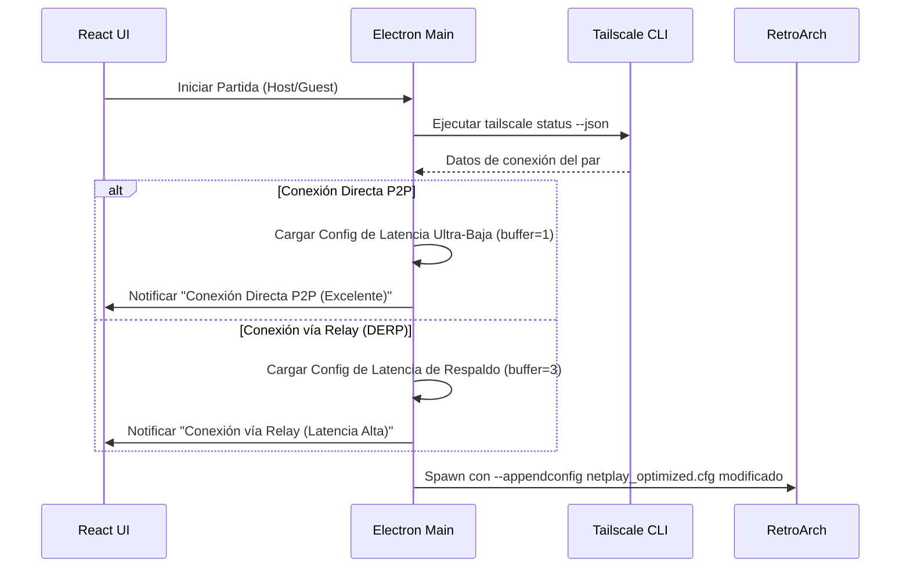
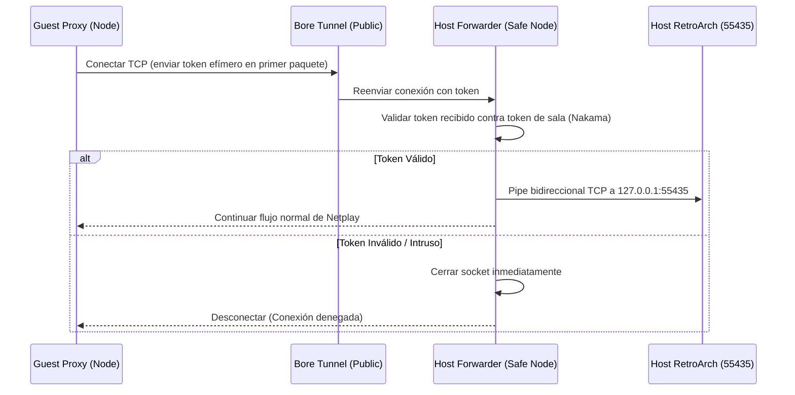

# Diseño Arquitectónico — Gemini 3.5 Flash

## 1. Arquitectura de Componentes Propuesta
La arquitectura de mejoras de Gemini se integra al Main Process de Electron estructurando submódulos dedicados para resolver responsabilidades específicas:

```mermaid
graph TD
    subgraph Renderer (React)
        UI[UI Components / Sala] <--> |IPC Events| IPC[IPC Bridge]
    end

    subgraph Main Process (Electron)
        IPC <--> |Llamadas IPC| MG[Main Manager]
        MG <--> Watchdog[Process Watchdog]
        MG <--> TS[Tailscale Diagnostic Client]
        MG <--> UDP[RetroArch UDP Control]
        MG <--> NK[Nakama Device Auth / Matchmaker]
        MG <--> Proxy[Safe TCP Forwarder + Token Check]
    end

    subgraph Procesos Externos
        Watchdog --> |Spawn / Monitor| RA[retroarch.exe]
        Watchdog --> |Spawn / Monitor| Bore[bore.exe]
        Watchdog --> |Spawn / Monitor| Nakama[nakama.exe]
        UDP -.-> |Sockets UDP 55400| RA
        Proxy <--> |Filtro TCP| Bore
    end
```

---

## 2. Flujo de Diagnóstico de Red y Lanzamiento Dinámico



---

## 3. Handshake de Seguridad en el Transparent Forwarder


