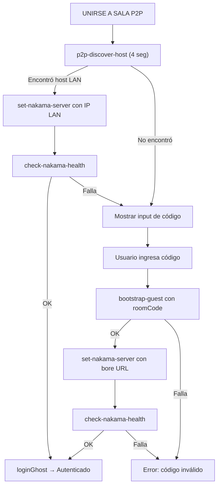
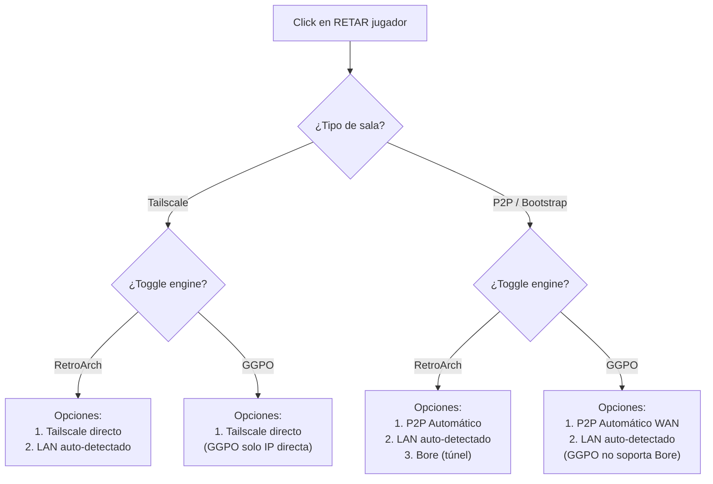

# Diseño - Reestructuración UI de Conexión

## Arquitectura General

```
┌─────────────────────────────────────────────────────────────────┐
│                        PANTALLA PRINCIPAL                       │
│                         (pre-autenticación)                     │
│                                                                 │
│   ┌─────── SALA TAILSCALE (cyan) ──────────────────────────┐   │
│   │  [CREAR SALA]              [UNIRSE A SALA]              │   │
│   │  • set-nakama localhost    • pedir IP Tailscale         │   │
│   │  • loginGhost              • set-nakama remoto          │   │
│   │  • open-firewall-port      • check health               │   │
│   │  • get-tailscale-ip        • loginGhost                 │   │
│   │  • publishHostInfo         • Guarda IP para reconexión  │   │
│   └─────────────────────────────────────────────────────────┘   │
│                                                                 │
│   ┌─────── SALA P2P (verde) ───────────────────────────────┐   │
│   │  [CREAR SALA]              [UNIRSE A SALA]              │   │
│   │  • set-nakama localhost    • 1) p2p-discover-host (4s)  │   │
│   │  • bootstrap-host          │   Si ok → conectar LAN     │   │
│   │  • p2p-start-broadcast    • 2) Si falla → pedir código │   │
│   │  • loginGhost              │   bootstrap-guest           │   │
│   │  • Muestra código          • loginGhost                 │   │
│   └─────────────────────────────────────────────────────────┘   │
│                                                                 │
└─────────────────────────────────────────────────────────────────┘

                    ┌──────────────────────┐
                    │   AUTENTICADO        │
                    │                      │
                    │ • Info de sala       │
                    │ • Toggle GGPO/RA     │
                    │ • (Sin colapsable)   │
                    │ • [DEBUG] (pequeño)  │
                    └──────────────────────┘

                    ┌──────────────────────┐
                    │   RETO (click        │
                    │   en sidebar)        │
                    │        ↓             │
                    │   MethodPicker       │
                    │   (dinámico)         │
                    └──────────────────────┘
```

## Diagrama de Flujo: Unirse a Sala P2P



## Diagrama de Flujo: MethodPicker Dinámico



## Diagrama de Flujo: Auto-detección LAN/WAN en Pelea

```mermaid
flowchart TD
    A["Reto aceptado"] --> B{"¿Método seleccionado?"}
    
    B -->|Tailscale| C["Usa IP Tailscale directa"]
    B -->|LAN auto| D["launch-game useRelay=false directConnectIp=LAN_IP"]
    B -->|P2P Automático| E{"¿Misma subred?"}
    B -->|Bore| F["start-relay-tunnel-v2 → launch-game useRelay=true"]
    
    E -->|Sí (LAN)| D
    E -->|No (WAN)| G{"¿Motor?"}
    
    G -->|RetroArch| H["p2p-host/guest → forwarder → launch-game"]
    G -->|GGPO| I["ggpo-p2p-host/guest → relay UDP → ggpo-launch"]
    
    C --> J["RetroArch: tailscale-host/guest<br/>GGPO: ggpo-launch con IP TS"]
```

## Diseño de Componentes

### 1. Nuevo Estado: `salaType`

```typescript
type SalaType = "tailscale" | "p2p" | null;
```

Este estado reemplaza `isP2pSala`, `isBootstrapSala` por un solo valor que indica cómo se creó la sala. Se guarda en contexto o en App.tsx.

### 2. Variables de Estado a Eliminar

| Estado Actual | Reemplazo |
|--------------|-----------|
| `isP2pSala` (boolean) | `salaType === "p2p"` |
| `isBootstrapSala` (boolean) | `salaType === "p2p"` (unificado) |
| `showOtherMethods` (boolean) | Se elimina (sin colapsable) |
| `myTailscaleIp` | Se mantiene solo si `salaType === "tailscale"` |

### 3. Variables de Estado a Mantener

| Estado | Razón |
|--------|-------|
| `joinMode` | Sigue necesario: null, "create", "join", "bootstrap" → cambia a: null, "create", "join", "p2p-code" |
| `nakamaHost`, `nakamaPort` | Conexión al servidor |
| `bootstrapRoomCode`, `bootstrapBoreUrl` | Código de sala P2P |
| `ggpoIp`, `engine` (via GgpoContext) | Toggle engine |
| `loading.*` | Estados de carga |

### 4. MethodPicker Refactorizado

```typescript
interface MethodPickerProps {
  targetName: string;
  salaType: SalaType;     // NUEVO: tipo de sala actual
  engine: GgpoEngine;      // NUEVO: motor seleccionado
  onSelect: (method: string) => void;
  onCancel: () => void;
}

// Lógica de filtrado de métodos
function getAvailableMethods(salaType: SalaType, engine: GgpoEngine) {
  if (salaType === "tailscale") {
    if (engine === "ggpo") {
      return [{ key: "tailscale", label: "TAILSCALE (DIRECTO)", accent: "#00f3ff" }];
    }
    return [
      { key: "tailscale", label: "TAILSCALE (DIRECTO)", accent: "#00f3ff" },
      { key: "lan", label: "LAN (AUTO-DETECTADO)", accent: "#0f0" },
    ];
  }
  // salaType === "p2p"
  if (engine === "ggpo") {
    return [
      { key: "p2p", label: "P2P AUTOMÁTICO", accent: "#0f0" },
      { key: "lan", label: "LAN (AUTO-DETECTADO)", accent: "#0f0" },
    ];
  }
  return [
    { key: "p2p", label: "P2P AUTOMÁTICO", accent: "#0f0" },
    { key: "lan", label: "LAN (AUTO-DETECTADO)", accent: "#0f0" },
    { key: "bore", label: "BORE (TÚNEL)", accent: "#0af" },
  ];
}
```

### 5. Estructura Post-Autenticación

```
┌──────────────────────────────────────────────────┐
│  > USUARIO CONECTADO <                            │
│                                                    │
│  ┌─ INFO SALA ──────────────────────────────────┐ │
│  │  🟢 SALA P2P ACTIVA / 🏠 SALA TAILSCALE     │ │
│  │  Código: 28734 (si P2P)                       │ │
│  │  IP: 100.x.x.x (si Tailscale)                │ │
│  │  Jugadores: Player1, Player2                  │ │
│  └──────────────────────────────────────────────┘ │
│                                                    │
│  ─── SEPARADOR ───                                │
│                                                    │
│  [RETROARCH ⬛━━━━ GGPO]  ← Toggle               │
│                                                    │
│  ─── SEPARADOR ───                                │
│                                                    │
│  [🔧 DEBUG] ← Botón pequeño al fondo             │
│                                                    │
│  ● WEBSOCKET CONNECTED                            │
└──────────────────────────────────────────────────┘
```

## Interacción con el Sistema de Retos (ChallengeContext)

### Cambios Necesarios en ChallengeContext

1. **`selectMethod`** debe recibir `salaType` como contexto adicional para saber si usar bootstrap relay o P2P directo.
2. **`acceptChallenge`** debe detectar automáticamente LAN cuando el método es "lan" (comparando subredes).
3. **El flag `isBootstrapChallenge`** se determina por `salaType === "p2p"` y no por `(window as any).__BOOTSTRAP_ACTIVE__`.

### Nuevo tipo para ChallengeData

```typescript
export interface ChallengeData {
  // ... existentes ...
  salaType?: "tailscale" | "p2p"; // NUEVO: cómo se creó la sala
}
```

## Convención de Colores Final

| Elemento | Color | Hex |
|----------|-------|-----|
| Sala Tailscale | Cyan | #00f3ff |
| Sala P2P | Verde | #0f0 |
| Método Bore | Azul claro | #0af |
| Debug | Púrpura | #a0a |
| Toggle GGPO activo | Primary (cyan) | theme.colors.primary |
